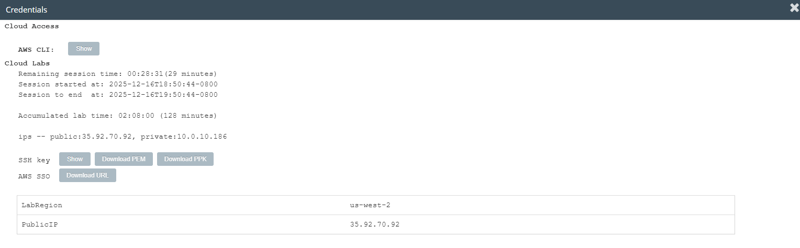
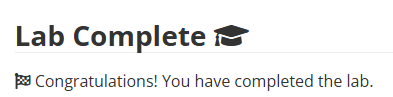

# Introduction to an Amazon Linux - Amazon Machine Image(AMI)

## Scenario

In this lab, you use Secure Shell (SSH) to access an Amazon Linux Amazon Machine Image (AMI) within Vocareum labs. Next, you use the man command to access the man pages.

## Objectives

After completing this lab, you will be able to:
 - Use SSH to access an Amazon Linux AMI within Vocareum labs
 - Understand the purpose of the man command
 - Demonstrate the search feature of the man pages
 - Examine man page headers.

## Task 1: Use SSH to connect to an Amazon Linux EC2 instance

1. On the AWS console, navigate to EC2, then select Instances.Choose/Select the instance. Go to details and make a note of the PublicIP address or copy it to your clipboard.

2. Select the Details drop-down menu above these instructions you are currently reading, and then select Show. A Credentials window will be presented.

3. Select the Download PPK button and save the labsuser.ppk file.

4. Then exit the Details panel.

5. Download  PuTTY to SSH into the Amazon EC2 instance.

6. Open putty.exe.

7. Configure your PuTTY session .

## Task 2: Explore the Linux man pages

1. To open the manual pages for the man program, enter the following command in the PuTTY terminal window, and press Enter:
`man man`

2. To identify the major sections of the man pages, look for the headers in the terminal.

3. The following are a few important man page headers. (This list is not all inclusive.):
 - NAME
 - SYNOPSIS
 - DESCRIPTION
 - OVERVIEW
 - EXAMPLES
 - FILES
 - OPTIONS
 - SEE ALSO
``

*Figure: The man page displays important information about a command.* ``

4.  Take note of the DESCRIPTION header, particularly the section numbers.
``

*The DESCRIPTION header provides an overview of a command.*``

5. To exit the man pages, enter: `q`

---

# Lab Complete