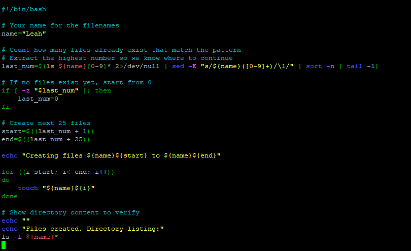

# Challenge Lab: Bash Shell Scripting Exercise

##  Project Overview
This project demonstrates a Bash script that automatically creates **25 empty (0 KB) files** each time it runs.

The files are named using **Leah + a number** (for example: `Leah1`, `Leah2`, `Leah3`, etc.).  
Each execution of the script continues numbering from the **highest existing file**, ensuring no files are overwritten and no numbers are hard-coded.
---


### Objectives

In this challenge, you will:
 - Create a directory.
  - Create 25 empty files using Bash
  - Automatically continue numbering on each run
  - Avoid hard-coded numbers by using automation
  - Verify file creation using a long directory listing


 ## Challenge

 

1. Write a Bash script based on the following requirements:
 
- Creates 25 empty (0 KB) files. (Hint: Use the touch command.)
 The file names should be <yourName><number>, <yourName><number+1>, <yourName><number+2>, and so on.
- Design the script so that each time you run it, it creates the next batch of 25 files with increasing numbers starting with the last or maximum number that already exists.
- Do not hard code these numbers. You need to generate them by using automation.
2. Test the script. Display a long list of the directory and its contents to validate that the script created the expected files

### Steps taken:

1. Open the AWS Management Console.

2. Navigate to EC2, then select Instances.Choose/Select the instance. Go to details and copy the PublicIP address to  your clipboard.

3. Use SSH to connect to an Amazon Linux EC2 instance 


4. Create the script file:
`nano create_files.sh`
 - Press CTRL + O, then ENTER
 - Press CTRL + X

5. Enter code:
 `#!/bin/bash`

6. Set the name for File creation
`name="Leah"`

7. Find the highest existing file number
```last_num=$(ls ${name}[0-9]* 2>/dev/null | sed -E "s/${name}([0-9]+)/\1/" | sort -n | tail -1)```

8. Handle first run
`if [ -z "$last_num" ]; then
    last_num=0
fi`

9. Calculate the next 25 file numbers
``start=$((last_num + 1))
end=$((last_num + 25))``

10. Create the files
``for ((i=start; i<=end; i++))
do
    touch "${name}${i}"
done`

11.  Display Confirmation Message
`echo "Creating files ${name}${start} to ${name}${end}"`

12. Verify the Files
`ls -l ${name}*`

13. Make the Script Executable
`chmod +x create_files.sh`

14. Run the Script
`./create_files.sh`

15. Test Automation - Run the script multiple times
`./create_files.sh`
 
   Output
   ``-rw-r--r-- 1 user user 0 Leah1
-rw-r--r-- 1 user user 0 Leah2
-rw-r--r-- 1 user user 0 Leah3
...``




---


### Script used

#!/bin/bash

# Your name for the filenames
name="Leah"

# Count how many files already exist that match the pattern
# Extract the highest number so we know where to continue
last_num=$(ls ${name}[0-9]* 2>/dev/null | sed -E "s/${name}([0-9]+)/\1/" | sort -n | tail -1)

# If no files exist yet, start from 0
if [ -z "$last_num" ]; then
    last_num=0
fi

# Create next 25 files
start=$((last_num + 1))
end=$((last_num + 25))

echo "Creating files ${name}${start} to ${name}${end}"

for ((i=start; i<=end; i++))
do
    touch "${name}${i}"
done

# Show directory content to verify
echo ""
echo "Files created. Directory listing:"
ls -l ${name}*


### Key Concepts Demonstrated
 - Bash scripting
 - Automation without hard-coded values
 - File handling using `touch`
 - Loops and conditional logic
 - Command-line verification using `ls -l`


 # Lab complete
