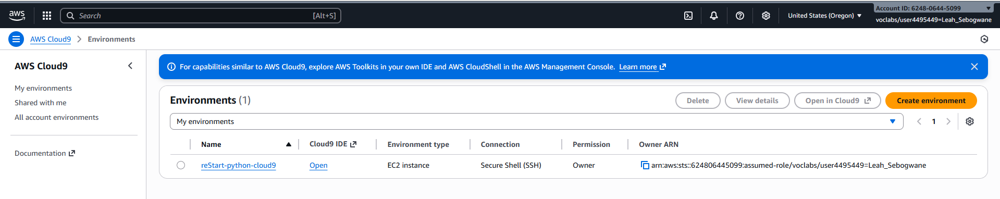
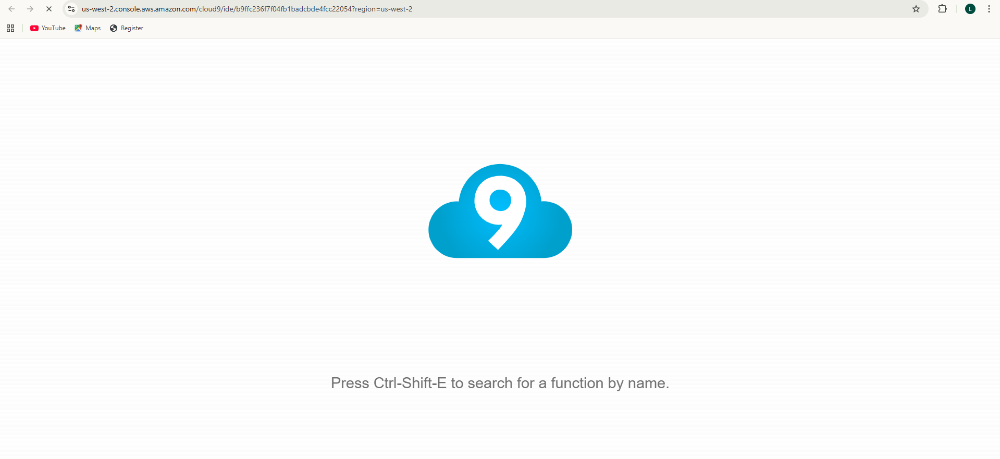

# Creating a Hello, World program

## Lab overview
Welcome to Introduction to Programming. For the labs, you will use the Python programming language.

In this lab, you will write your first Python program.

### Accessing the AWS Cloud9 IDE

1. In the AWS Management Console, choose Services > Cloud9. In the Your environments panel, locate the reStart-python-cloud9 card, and choose Open IDE.

2. From the menu bar of the AWS Cloud9 IDE, choose File > New From Template > Python File.

3. Choose File > Save As..., and provide a suitable name for the exercise file (for example, hello-world.py) and save it under the /home/ec2-user/environment directory.

4. In your AWS Cloud9 IDE, choose the + icon and select New Terminal.

--- 

5. To display the present working directory, enter `pwd`. This command points to */home/ec2-user/environment*.

6. To confirm the default version of Python that is installed in your lab, in the open terminal tab, enter:
 `python --version`

7.  To check other available versions of Python, enter the following commands:
 `python2 --version`
 `python3 --version`

Results
``~ $ python --version                                                                      Python 3.6.12                                                                                    
~ $ python2 --version                                                                     Python 2.7.18                                                                                    
~ $ python3 --version                                                                     Python 3.6.12 ``

---

8. From the navigation pane of the IDE, choose the file that you created in the previous Creating your Python exercise file section.

9. In the file, enter the following code:
 `print("Hello, World")`
 - To save the file, choose: File > Save
 - Near the top of the IDE window, choose the Run (Play) button.
 - In the bottom pane of the IDE, confirm that the program prints the words Hello World.

.png>)
.png>)

# Lab complete